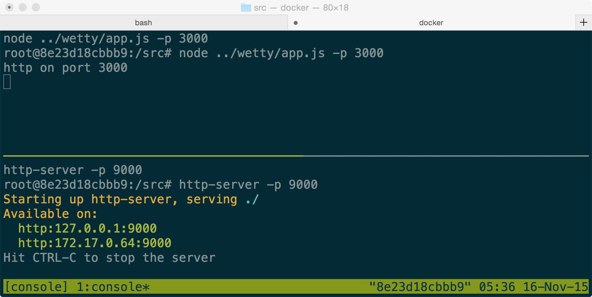
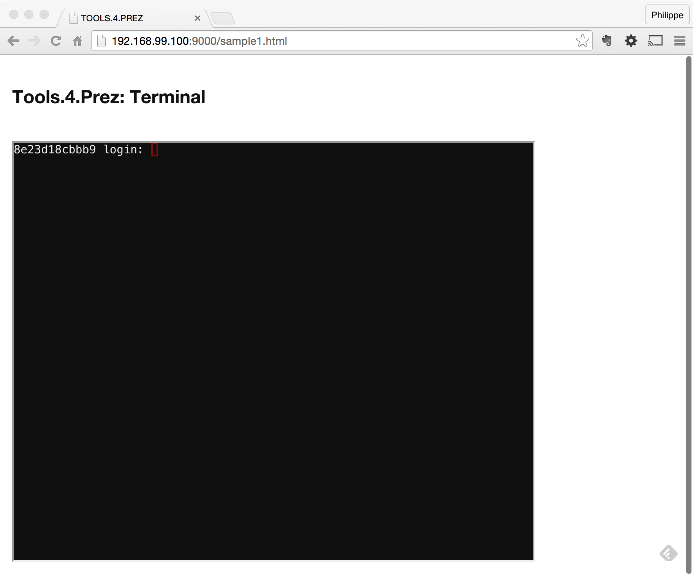
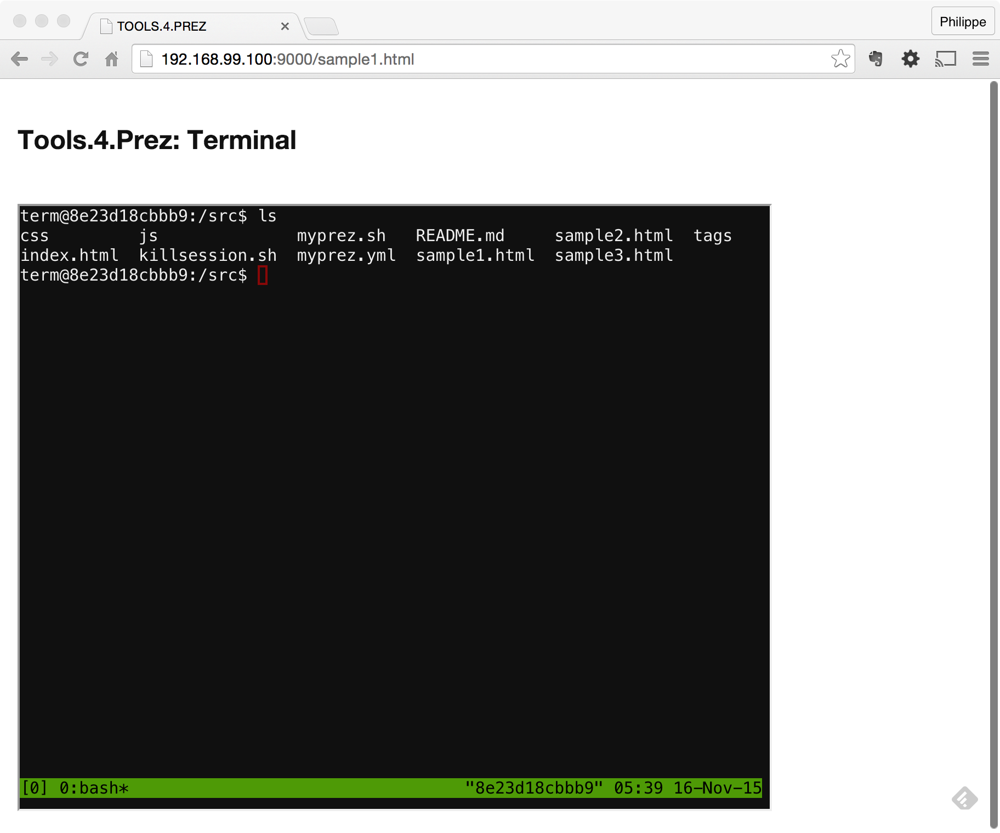
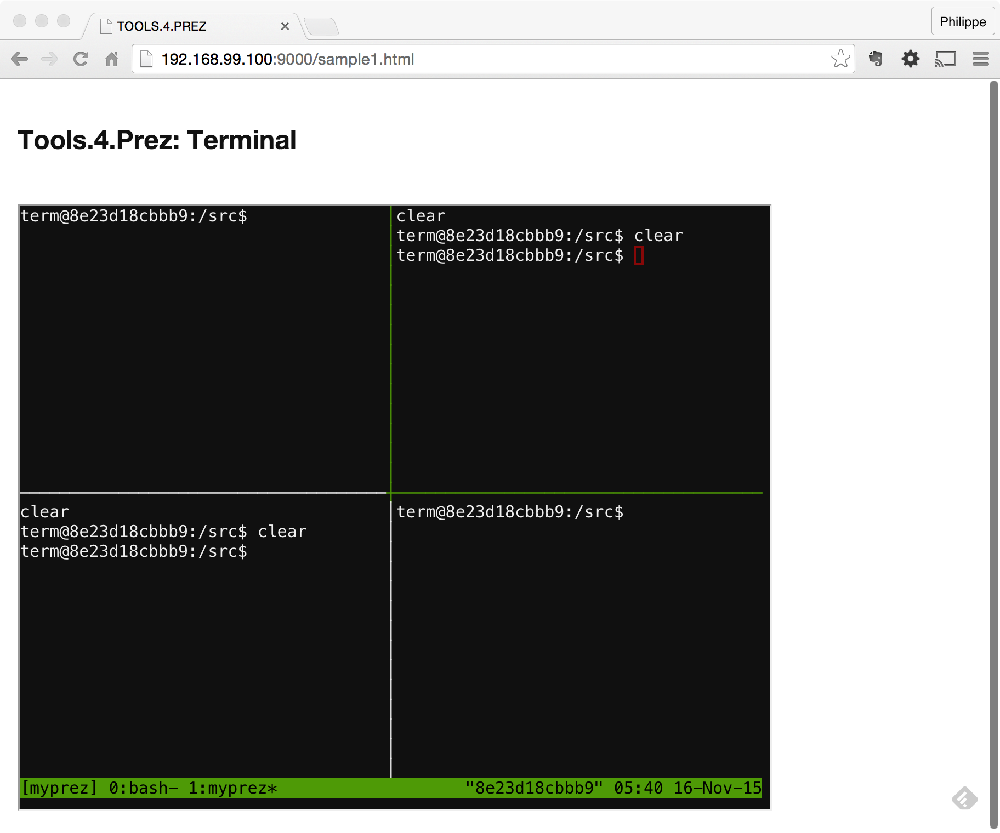
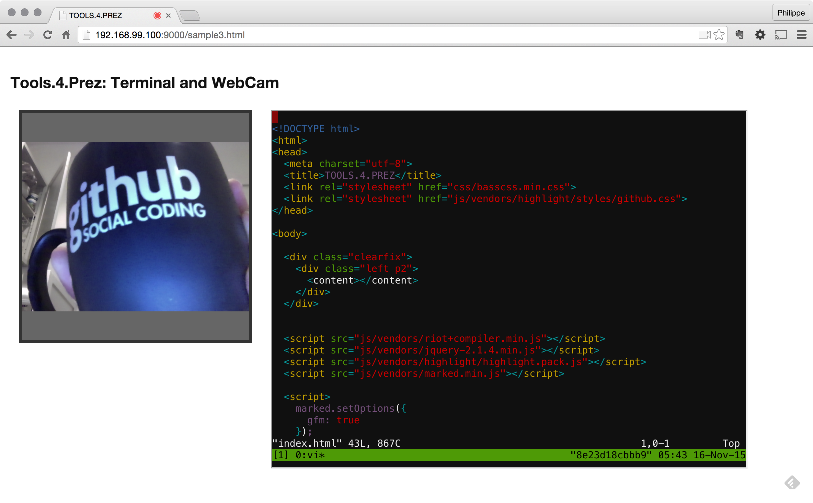

# PrezTools

During my talks, I need to switch between slideware, terminal, webcam, ide, ... Sometimes it's difficult.
So I've prepared some "helpers" to help me. Now, I can display a terminal and a webcam stream in the same html page thanks some useful tools.

## BackEnd Dependencies

- [Docker]()
- [Wetty](https://github.com/krishnasrinivas/wetty)
- [Tmux](https://tmux.github.io/)
- [Teamocil](http://www.teamocil.com/)
- [Node](https://nodejs.org/en/)
- [http-server](https://www.npmjs.com/package/http-server)

## FrontEnd Dependencies

- [http://riotjs.com/](http://riotjs.com/) *v2.3.1*
- [http://www.basscss.com/](http://www.basscss.com/) *v7.0.4*
- [https://jquery.com/](https://jquery.com/) *v2.1.4*
- [https://github.com/chjj/marked](https://github.com/chjj/marked) *v0.3.4*
- [https://github.com/isagalaev/highlight.js](https://github.com/isagalaev/highlight.js)

## Build

You have to fork this repository, an type the following command to build the Docker image:

    docker build -t preztools assets/ 

**Remark**: `/src` is the working directory (you can put what you want in it) 

## Run and use

Type the following command (in a docker terminal):

    docker run -v ~/complete_path_to/src:/src -p 9000:9000 -p 3000:3000 -i -t preztools

**Remark**: `3000` is the **Wetty** port, `9000` is the http port (static assets are served by **http-server**)

- Now, open [http://192.168.99.100:9000/](http://192.168.99.100:9000/), and you land to a home page (that you can change, go and see the `/src` directory).
- Select the link [http://192.168.99.100:9000/sample1.html](http://192.168.99.100:9000/sample1.html)
- You get a terminal in your web page!!!
- To login: user is `term`, password is `term` 

## Split my terminal

Once logged, a tmux session is open. If you type `ls`, you can see a teamocil configuration file: `myprez.yml`, with this content:

    name: myprez
    windows:
      - name: myprez
        root: /src
        layout: tiled
        panes:
          - clear
          - clear
          - clear
          - clear

Now, type this: `teamocil --layout myprez.yml`, and ...  

Of course you can write your own configuration files. 
And even show a video stream and some source code with **vi**. (try [http://192.168.99.100:9000/sample3.html](http://192.168.99.100:9000/sample3.html))

  
 
 

    
    